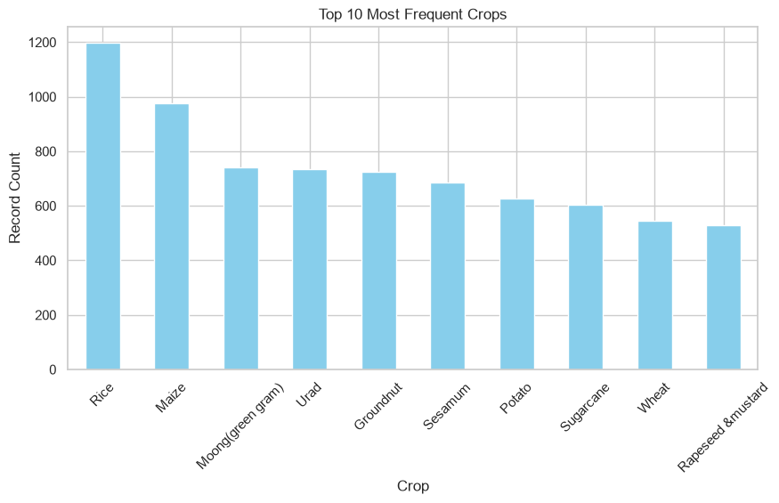
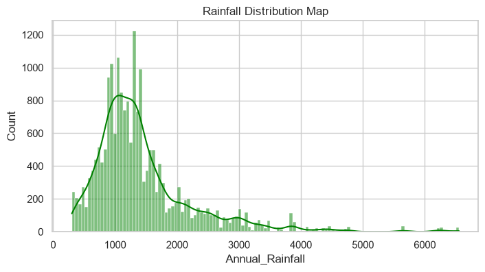
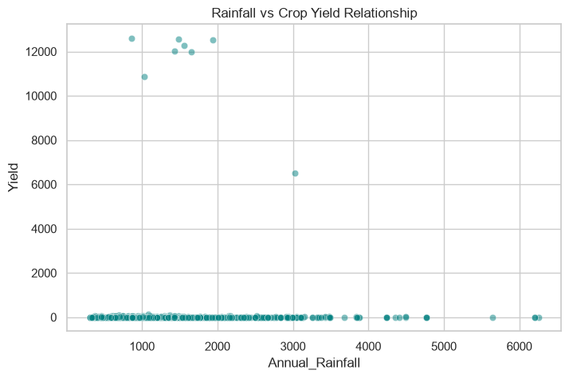
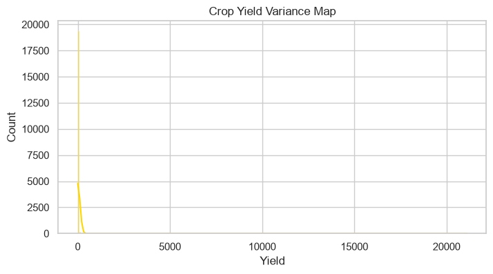

# Crop-Yield-Prediction-Module1
# Crop Yield Prediction - Module 1 (Preprocessing & EDA)

This module handles the Exploratory Data Analysis (EDA) and data preprocessing pipeline for the Crop Yield Prediction project. It cleans the raw data, visualizes feature distributions, and exports a trained preprocessor object.

## 📁 Repository Structure
* `modul1_preprocessing.py`: Main Python script containing data cleaning and preprocessing logic.
* `preprocessor.joblib`: Serialized binary file containing the fitted data transformer.
* `cleaned_crop_yield.csv`: The finalized dataset after handling missing values and preprocessing.

---

## 📊 Exploratory Data Analysis (EDA)

### 1. Crop Frequency Distribution
An analysis of the top 10 most frequent crops present in our dataset.


### 2. Rainfall Distribution
Visualizing how rainfall amounts are spread across all recorded regions.


### 3. Rainfall vs. Crop Yield
A scatter plot demonstrating the relationship and trend between precipitation levels and final crop yield.


### 4. Yield Distribution
Analyzing the spread and distribution skewness of the target variable (Crop Yield).


---

## 🚀 How to Use the Preprocessor
You can load the saved `.joblib` preprocessor directly into your model training script using:
```python
import joblib

# Load the preprocessing pipeline
preprocessor = joblib.load('preprocessor.joblib')
```
